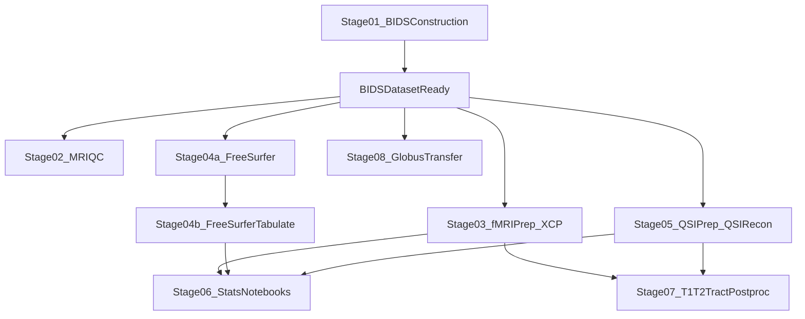

# End-to-End Pipeline Guide

This guide explains how to run the ROSMAP MRI pipeline after cloning the repository, and how to verify each stage.

## Prerequisites

- Linux environment with SLURM (`sbatch`) access.
- Apptainer/Singularity module available on the cluster.
- Container images available for MRIQC, fMRIPrep, XCP-D, FreeSurfer, QSIPrep, and neuromaps.
- A valid FreeSurfer license file.
- BIDS dataset prepared at your chosen `BIDS_DIR`.
- Optional but recommended:
  - Conda environment with MRtrix for stage 07.
  - Globus CLI setup for stage 08.

## Quick Start (Few Commands)

From repository root:

1. Edit central configuration:
   - `config.sh`
2. Run the main processing stages:
   - `bash 02_quality_control/mriqc/submit_job_array.sh`
   - `bash 03_fmri_processing/fmriprep_xcp/submit_job_array.sh`
   - `bash 04_anatomical_processing/freesurfer/submit_job_array.sh`
   - `bash 05_dwi_processing/qsiprep/submit_job_array.sh`
3. After FreeSurfer finishes, run tabulation:
   - `bash 04_anatomical_processing/freesurfer_tabulate/submit_job_array.sh`
4. Run analysis and postprocessing manually as needed:
   - notebooks in `06_statistical_analysis/`
   - `bash 07_postprocessing/t1t2_ratio/Pull_T1T2_ForcepsMinor_NoParallel.sh`

## Pipeline Dependencies

## Stage-by-Stage Walkthrough

## 01 BIDS Construction

- **Run command**
  - Historical Python scripts in `01_bids_construction/scripts/` are run manually.
- **Recommended script order**
  1. `Copy_Files.py`
  2. `Organize.py`
  3. `Rename2.py` (or `Rename.py` + correction scripts)
  4. `MetaAddition.py`
  5. `Correct_Fmap-HARDI_Meta.py`
  6. `EPI_Corrections.py`
  7. `Bold_DWI_PEDs.py`
  8. `FMAP_less_subjects.py` and `Move_FMAP_less.py` if needed
  9. cleanup scripts (`move_T2.py`, `Rem_Extras.py`, `DebugRename.py`, `Rename_Move_Met_New.py`)
- **Inputs**
  - `01_bids_construction/reference_csvs/OG_Locations.csv`
  - `01_bids_construction/reference_csvs/Openmind_Directoris.csv`
- **Outputs**
  - BIDS directory tree at `BIDS_DIR/sub-*/ses-*`
- **Verify**
  - Confirm each subject/session has `anat`, `dwi`, `func`, and (if present) `fmap`.
  - Check JSON sidecars include expected metadata fields.
- **Estimated time**
  - Minutes to hours depending on copy volume.
- **Common issues**
  - Missing source directories in CSV tables.
  - Incomplete metadata in sidecars (rerun metadata scripts after rename corrections).

## 02 Quality Control (MRIQC)

- **Run command**
  - `bash 02_quality_control/mriqc/submit_job_array.sh`
- **Inputs**
  - `BIDS_DIR/sub-*/ses-*/anat/*T1w.nii.gz`
  - optional `T2w`, `bold` files
- **Outputs**
  - `${OUTPUT_DIR}/mriqc_${MRIQC_VERSION}/sub-*/`
  - `${OUTPUT_DIR}/mriqc_${MRIQC_VERSION}/sub-*.html`
- **Verify**
  - One HTML report per processed subject.
  - No failed subjects in SLURM logs.
- **SLURM resources per subject**
  - time: `4:00:00`
  - memory: `24GB`
  - CPUs: `12`
- **Estimated time**
  - ~20-90 minutes/subject.
- **Common issues**
  - Missing container path in `config.sh`.
  - Missing TemplateFlow/cache mounts.

## 03 fMRI Processing (fMRIPrep + XCP-D)

- **Run command**
  - `bash 03_fmri_processing/fmriprep_xcp/submit_job_array.sh`
- **Inputs**
  - Resting-state BOLD and anatomical images in BIDS.
  - FreeSurfer license file (`FREESURFER_LICENSE`).
- **Outputs**
  - `${OUTPUT_DIR}/fmriprep_${FMRIPREP_VERSION}/`
  - `${OUTPUT_DIR}/freesurfer_${FREESURFER_VERSION}/` (if generated/reused)
  - `${OUTPUT_DIR}/xcp_d_${XCP_VERSION}/` (when XCP command enabled)
- **Verify**
  - Subject HTML and derivative folders exist in fMRIPrep output.
  - Check SLURM logs for command completion.
- **SLURM resources per subject**
  - time: `2-00:00:00`
  - memory: `16GB`
  - CPUs: `4`
- **Estimated time**
  - ~2-10 hours/subject.
- **Common issues**
  - FreeSurfer license path not valid.
  - Subject-level scratch quota exceeded.

## 04 Anatomical Processing

### 04a FreeSurfer

- **Run command**
  - `bash 04_anatomical_processing/freesurfer/submit_job_array.sh`
- **Inputs**
  - `BIDS_DIR/sub-*/ses-*/anat/*T1w.nii.gz`
  - optional `*T2w.nii.gz`
- **Outputs**
  - `${OUTPUT_DIR}/freesurfer_${FREESURFER_VERSION}/sub-*`
- **Verify**
  - Subject directories and FreeSurfer `scripts/recon-all.log` created.
- **SLURM resources per subject**
  - time: `2-00:00:00`
  - memory: `20GB`
  - CPUs: `8`
- **Estimated time**
  - ~4-20 hours/subject.

### 04b FreeSurfer Tabulate

- **Run command**
  - `bash 04_anatomical_processing/freesurfer_tabulate/submit_job_array.sh`
- **Inputs**
  - `${OUTPUT_DIR}/freesurfer_${FREESURFER_VERSION}/sub-*`
  - atlas annots in `04_anatomical_processing/freesurfer_tabulate/annots/`
- **Outputs**
  - `${OUTPUT_DIR}/freesurfer_tabulate/sub-*/`
  - subject-level `*brainmeasures.*`, `*regionsurfacestats.tsv`
- **Verify**
  - `brainmeasures` and regional surface stat files exist per subject.
- **SLURM resources per subject**
  - time: `3-00:00:00`
  - memory: `8GB`
  - CPUs: `4`
- **Estimated time**
  - ~1-6 hours/subject.

## 05 DWI Processing (QSIPrep + QSIRecon)

- **Run command**
  - `bash 05_dwi_processing/qsiprep/submit_job_array.sh`
- **Inputs**
  - `BIDS_DIR/sub-*/ses-*/dwi/*dwi.nii.gz` + bvals/bvecs
  - `QSIPREP_RECON_SPEC` from `config.sh`
- **Outputs**
  - `${OUTPUT_DIR}/qsiprep_${QSIPREP_VERSION}/`
  - `${OUTPUT_DIR}/qsirecon_${QSIPREP_VERSION}/`
- **Verify**
  - Per-subject html reports and derivative subject folders.
- **SLURM resources per subject**
  - time: `2-00:00:00`
  - memory: `16GB`
  - CPUs: `8`
- **Estimated time**
  - ~3-12 hours/subject.
- **Common issues**
  - Missing recon spec path.
  - Missing FreeSurfer outputs when reconstruction expects them.

## 06 Statistical Analysis

- **Run path**
  - notebooks in `06_statistical_analysis/notebooks/`
  - wrangling notebooks in `06_statistical_analysis/data_wrangling/`
- **Inputs**
  - derivative outputs from stages 03/04/05 plus metadata CSVs
- **Outputs**
  - final model CSVs in `06_statistical_analysis/results/`
- **Verify**
  - notebook cells run cleanly and result tables match expected rows.
- **Estimated time**
  - highly variable by model complexity and figure generation.

## 07 Postprocessing (T1/T2 Along Tracts)

- **Run commands**
  - serial: `bash 07_postprocessing/t1t2_ratio/Pull_T1T2_ForcepsMinor_NoParallel.sh`
  - array-style: submit `Pull_T1T2_ForcepsMinor.sh` with explicit `--array` when needed
- **Inputs**
  - `${XCP_DERIV_DIR}` and `${QSIRECON_DERIV_DIR}`
- **Outputs**
  - `${T1T2_OUTPUT_DIR}/sub-*_ses-*_t1t2_stats.csv`
  - `${T1T2_OUTPUT_DIR}/t1t2_ratio_summary.csv`
- **Verify**
  - summary CSV has one row per processed subject/session.
- **SLURM resources**
  - parallel script: `24:00:00`, `500G`, `256` cores
  - serial script: `47:00:00`, `256G`, `64` cores
- **Estimated time**
  - serial: many hours to days for full cohort.

## 08 Data Transfer (Globus)

- **Run command**
  - `bash 08_data_transfer/Transfer_BIDS.sh`
- **Inputs**
  - populated BIDS directory at `TRANSFER_SOURCE_DIR`
  - valid source/destination endpoint IDs
- **Outputs**
  - transfer batch file and initiated Globus transfer task
- **Verify**
  - `globus task show <task_id>` indicates completion.
- **SLURM resources in script**
  - time: `47:00:00`
  - memory: `128G`
  - cores: `32`
  - GPU request present in script (remove if not required on your cluster)

## Troubleshooting Checklist

- Confirm all required `config.sh` fields are edited before submission.
- Run one test subject per stage first.
- Confirm `FREESURFER_LICENSE` points to a real license file.
- Confirm container image files exist and are readable.
- Check SLURM logs first, then subject-level HTML reports.
