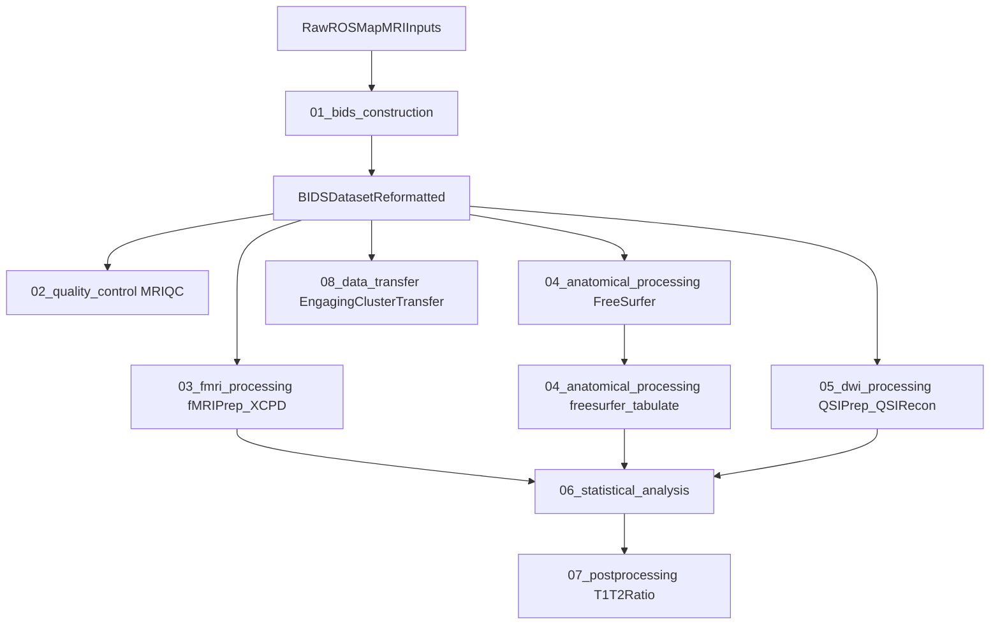

# ROSMAP-SI-MRI

Consolidated MRI pipeline repository for the ROSMAP Social Isolation project.

This repository reorganizes and documents the workflow originally developed in:

- `/om2/user/mabdel03/files/Ravi_ISO_MRI`

Only scripts, configuration files, notebooks, and lightweight tabular metadata were copied.
Raw/derivative imaging data were intentionally not copied.

## Quick Start

1. Clone repository.
2. Edit [`config.sh`](config.sh) once for your environment.
3. Follow the end-to-end runbook in [`GUIDE.md`](GUIDE.md).
4. Launch stages in order with the stage submit scripts.

## Prerequisites (Summary)

- SLURM + Apptainer/Singularity environment
- required container images present (`MRIQC`, `fMRIPrep`, `XCP-D`, `FreeSurfer`, `QSIPrep`, `neuromaps`)
- valid FreeSurfer license path
- BIDS dataset path configured
- optional: MRtrix conda env for stage 07 and Globus CLI for stage 08

## Pipeline Dependency/Ordering Overview

## Repository Layout

- [`01_bids_construction`](01_bids_construction/README.md): scripts and reference files used to build and repair BIDS structure.
- [`02_quality_control`](02_quality_control/README.md): MRIQC SLURM pipeline scripts and model config.
- [`03_fmri_processing`](03_fmri_processing/README.md): fMRIPrep + XCP-D SLURM pipeline scripts.
- [`04_anatomical_processing`](04_anatomical_processing/README.md): FreeSurfer and FreeSurfer tabulation workflow.
- [`05_dwi_processing`](05_dwi_processing/README.md): QSIPrep + QSIRecon scripts and reconstruction spec.
- [`06_statistical_analysis`](06_statistical_analysis/README.md): notebooks, wrangling files, and final model result CSVs.
- [`07_postprocessing`](07_postprocessing/README.md): T1/T2-ratio tract-level extraction scripts.
- [`08_data_transfer`](08_data_transfer/README.md): Globus transfer script to move BIDS dataset to Engaging.
- `metadata`: participant-level metadata table used in downstream modeling.

## Copied From Original Project

Included:

- Python, shell, and notebook workflows used in processing and analysis
- Pipeline configs (e.g., `recon_spec.json`, MRIQC model JSON)
- Reference CSV files and final model result CSV outputs
- Example JSON-only BIDS structure (`01_bids_construction/example_bids_structure`)

Excluded:

- NIfTI and other bulk imaging files
- Large derivative outputs (fMRIPrep/QSIPrep/FreeSurfer result trees)
- Scratch/intermediate runtime artifacts
- Notebook checkpoint folders
- Internal `.git` / `.datalad` metadata from copied tool subdirectories

## Reproducibility Notes

- Runtime configuration is centralized in [`config.sh`](config.sh).
- Most heavy processing stages assume SLURM scheduling and Apptainer/Singularity.
- Stage 01 scripts are historical/manual and may still require path edits based on source data location.

## Stage Documentation

Each stage has its own README with:

- purpose
- key scripts
- expected inputs/outputs
- run patterns on cluster
- caveats specific to that stage

For full command-by-command execution and validation checks, use [`GUIDE.md`](GUIDE.md).
