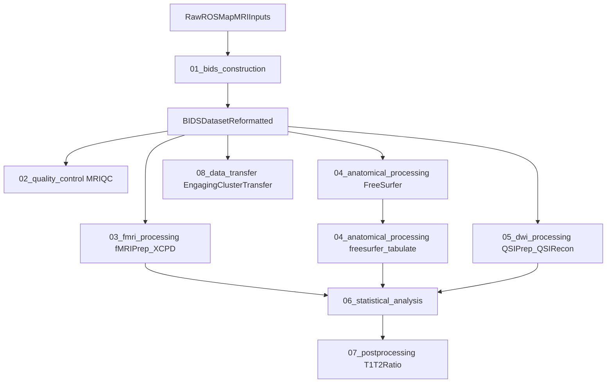

# ROSMAP-SI-MRI

Consolidated MRI pipeline repository for the ROSMAP Social Isolation project.

This repository reorganizes and documents the workflow originally developed in:

- `/om2/user/mabdel03/files/Ravi_ISO_MRI`

Only scripts, configuration files, notebooks, and lightweight tabular metadata were copied.
Raw/derivative imaging data were intentionally not copied.

## Pipeline Overview

## Repository Layout

- `01_bids_construction`: scripts and reference files used to build and repair BIDS structure.
- `02_quality_control`: MRIQC SLURM pipeline scripts and model config.
- `03_fmri_processing`: fMRIPrep + XCP-D SLURM pipeline scripts.
- `04_anatomical_processing`: FreeSurfer and FreeSurfer tabulation workflow.
- `05_dwi_processing`: QSIPrep + QSIRecon scripts and reconstruction spec.
- `06_statistical_analysis`: notebooks, wrangling files, and final model result CSVs.
- `07_postprocessing`: T1/T2-ratio tract-level extraction scripts.
- `08_data_transfer`: Globus transfer script to move BIDS dataset to Engaging.
- `metadata`: participant-level metadata table used in downstream modeling.

## Copied From Original Project

Included:

- Python, shell, and notebook workflows used in processing and analysis
- Pipeline configs (e.g., `recon_spec.json`, MRIQC model JSON)
- Reference CSV files and final model result CSV outputs
- Example JSON-only BIDS structure (`01_bids_construction/example_bids_structure`)

Excluded:

- NIfTI and other bulk imaging files
- Large derivative outputs (fMRIPrep/QSIPrep/FreeSurfer result trees)
- Scratch/intermediate runtime artifacts
- Notebook checkpoint folders
- Internal `.git` / `.datalad` metadata from copied tool subdirectories

## Notes On Reproducibility

- Many scripts include hardcoded absolute cluster paths from the original environment.
- Most processing scripts assume SLURM scheduling plus Apptainer/Singularity containers.
- This repo preserves historical scripts first; parameterization and modern env packaging are possible next steps.

## Stage Documentation

Each stage has its own README with:

- purpose
- key scripts
- expected inputs/outputs
- run patterns on cluster
- caveats specific to that stage
